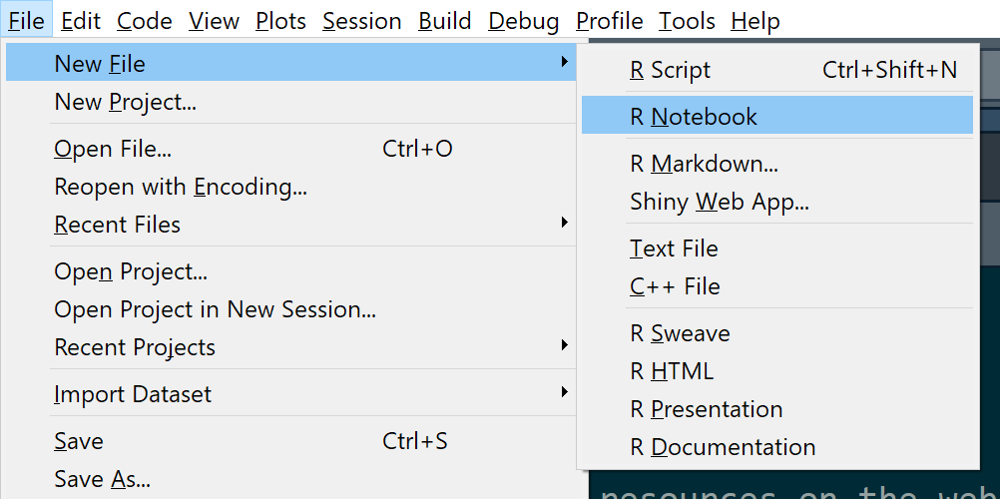
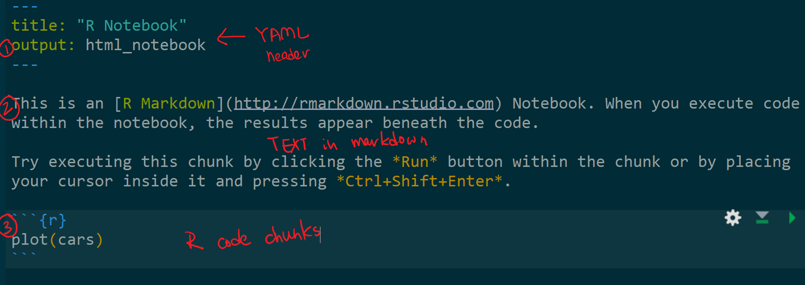
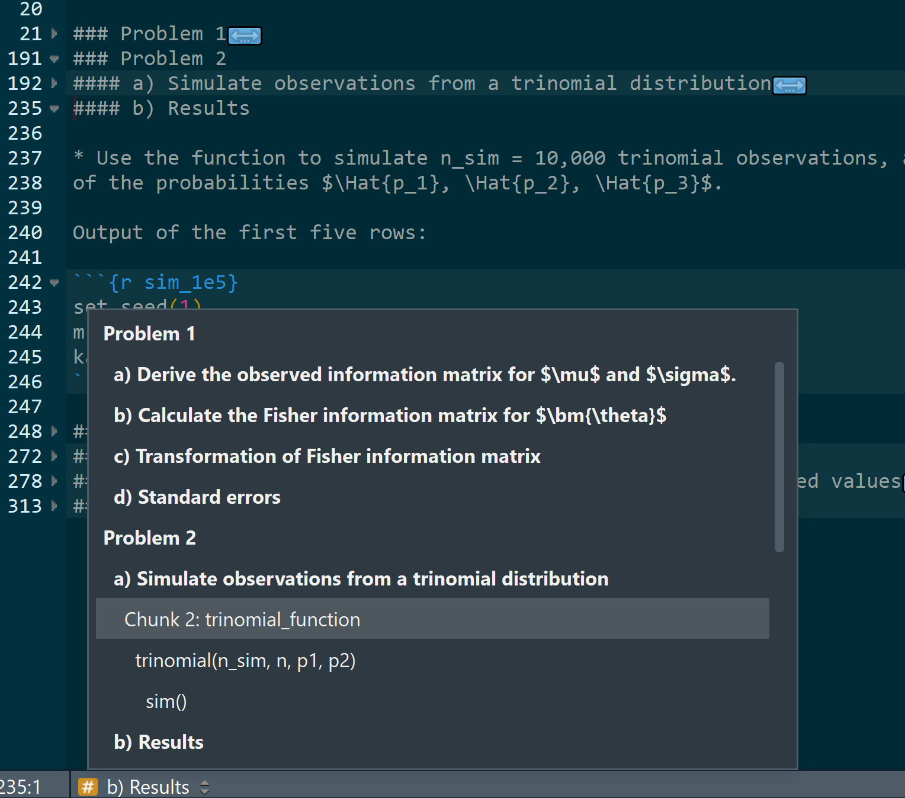

R Markdown Quick Start
================
Foon Wong
January 31, 2018

-   [Introduction](#introduction)
-   [Quick Start](#quick-start)
    -   [Document structure](#document-structure)
    -   [How it works](#how-it-works)
-   [Resources and links](#resources-and-links)
    -   [R Markdown](#r-markdown)
    -   [LaTeX](#latex)
-   [pdf and LaTeX](#pdf-and-latex)
    -   [Software prerequisites](#software-prerequisites)
    -   [Using LaTeX packages](#using-latex-packages)
    -   [Math](#math)
-   [Practical Tips](#practical-tips)
    -   [Global options](#global-options)
    -   [Organization and navigation](#organization-and-navigation)
    -   [Tables](#tables)
    -   [Common problems](#common-problems)
    -   [Hotkeys](#hotkeys)
    -   [Finding help](#finding-help)

#### Introduction

Rmarkdown is a wonderful way to generate high quality reports for all your R projects. Here's some resources and tips to help you get started.

Quick Start
-----------

-   Follow the wizard to create a new document.
    

#### Document structure

The default new file template explains the structure:

1.  *YAML header* in which you can specify your document metadata, output [formats](http://rmarkdown.rstudio.com/formats.html) and other global options.

2.  [Text in markdown](http://rmarkdown.rstudio.com/authoring_basics.html), which will be automatically converted into other formats: html, pdf, word documents and etc. The syntax is simple and you can learn all the basics in 5 minutes. [More on the basics here](http://www.stat.cmu.edu/~cshalizi/rmarkdown/#basic-formatting-in-r-markdown).

3.  [R code chunks](http://www.stat.cmu.edu/~cshalizi/rmarkdown/#including-code) (**Ctrl + Alt + I **) R code can be easily inserted inline, or written in chunks. All code written in the chunks are executed when you knit the file. By default, both the code and output is displayed.



-   Hit **Ctrl + Alt + K** to knit or render your document. Easy!

#### How it works

From rstudio:


The knit command processes the .rmd file using knitr(). All the code is executed and a markdown file is created. [pandoc](http://pandoc.org/) does the rest of the magic converted the file to your desired output format.

Resources and links
-------------------

#### R Markdown

-   [Using R Markdown for Class Reports](http://www.stat.cmu.edu/~cshalizi/rmarkdown/): Fantastic guide by Cosma Shalizi. Must read. I am referencing it as I am writing this now.

-   [Official introduction](http://rmarkdown.rstudio.com/lesson-1.html): If you are totally foreign to rmarkdown. Check out Rstudio's great tutorial and examples.

-   [Official cheatsheet](https://github.com/rstudio/cheatsheets/raw/master/rmarkdown-2.0.pdf): Cheatsheet from Rstudio.

-   [Markdown live preview](http://markdownlivepreview.com/): A quick way to understand how to write markdown if you have never written markdown before. See instantaneously how the markdown syntax works. It's also a great tool for troubleshooting.

-   [KableExtra](https://haozhu233.github.io/kableExtra/): awesome styling options for your tables.

#### LaTeX

-   [ShareLaTeX](https://www.sharelatex.com/): While rstudio does preview for LaTeX math, it's really better to edit LaTeX code with purpose built tools.

-   [LaTeX-Tutorial.com](https://www.latex-tutorial.com/): An introduction to LaTeX.

-   [AMS Short Math Guide for LaTeX](ftp://ftp.ams.org/pub/tex/doc/amsmath/short-math-guide.pdf): For full control over your mathematical notation, be sure to check out this guide from the American Mathematical Society.

-   [excel2LaTeX](http://excel2latex.com/): Pretty handy for making a quick table.

pdf and LaTeX
-------------

#### Software prerequisites

pdf documents are typesetted using LaTeX. Installation links:
- [MikTex](https://miktex.org/download) (Windows) Download the "net installer" and choose complete installation (Large file!).

-   [MacTex](https://tug.org/mactex/mactex-download.html) (Mac).

#### Using LaTeX packages

-   If you need to use LaTeX packages, modify your YAML like so:

<!-- -->

    ---
    title: 'Homework I (Part II)'
    author: "Foon Wong"
    date: "February 4, 2018"
    output: pdf_document
    header-includes:
    - \usepackage{amsmath}
    - \usepackage{amssymb}
    ---

#### Math

-   Rmarkdown has support for a lot of LaTeX commands. Just like a regular TeX document, you can have:

    -   inline math: surround your LaTeX code with a pair of `$`.
    -   Longer blocks of math: write between `\[` and `\]`.

-   In addition, I recommend using the extensions published by the American Mathematical Society: `amssymb` and `amsmath`. See the [short guide here](ftp://ftp.ams.org/pub/tex/doc/amsmath/short-math-guide.pdf).

Practical Tips
--------------

#### Global options

You can apply [options](https://yihui.name/knitr/options/) to your code chunks globally. I typically use the following in my first code chunk:

``` r
# Hides all code except for output
knitr::opts_chunk$set(echo = F)
```

#### Organization and navigation

-   Organize your document using headers. The character `#` means that the rest of the line is interpreted as a header. This allows you to quickly jump to (**Shift + Alt + J**) and hide (**Alt + O**) different sections of your document.



-   Name your code chunks. Facilitates navigation and troubleshooting.

#### Tables

-   Use the packages kable and [kableExtra](https://cran.r-project.org/web/packages/kableExtra/vignettes/awesome_table_in_html.html) to format your tables. It can do some really cool things in html.

-   [excel2LaTeX](http://excel2latex.com/): Pretty handy for making a quick table.

-   [math expressions in kable](https://stackoverflow.com/questions/45391566/latex-math-expression-in-knitr-kable-sweave): Use option `escape=FALSE` in kable.

-   [Get rid of \\addlinespace in kable](https://stackoverflow.com/questions/45409750/get-rid-of-addlinespace-in-kable): overwrites the default extra spacing every 5th row when using booktab.

#### Common problems

-   [Newline doesn't start](http://www.stat.cmu.edu/~cshalizi/rmarkdown/#paragraph-breaks-and-forced-line-breaks) - paragraph breaks need a completely blank line. Forced line breaks require **two** blanks spaces at the end of the line.

-   LaTeX Math: LaTeX rendering can be *very sensitive* to spacing. If you have newlines in between \`$'s, it may break.

#### Hotkeys

-   **Ctrl + Shift + K**: knits the text file to your desired output format.
-   **Ctrl + Alt + I (OS X: Cmd + Option + I)**: Inserts a r code chunk.
-   **Ctrl + Shift + Enter**: Execute a code chunk.
-   **Shift + Alt + J**: Navigation.

#### Finding help

[StackOverflow](https://stackoverflow.com/)
